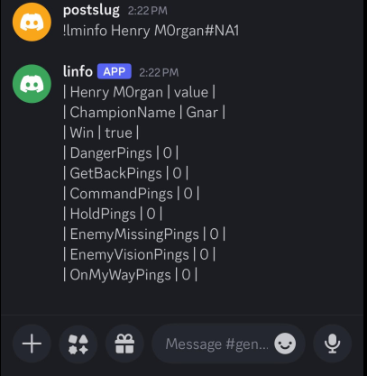
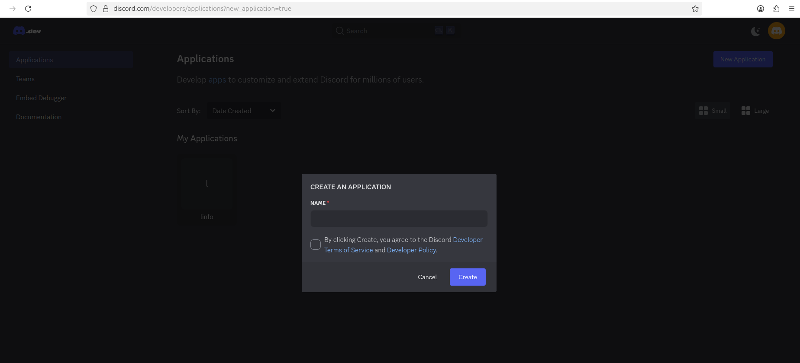
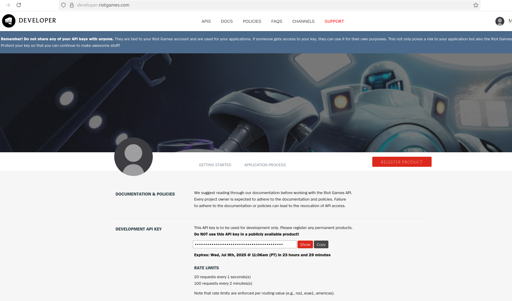

# League-Info Discord Bot

This is a small discord bot to hit the League of Legends API and return relevant information to the requested channel.
A user in the channel can send the following command

`!lminfo <GameName>#<tagLine>`

to output a formatted text blob of the players last matches Ping Count breakdown. Game Name can have any alphanumeral aswell as spaces,

## Set Up

You'd first need to get a discord bot key and grant bot access to the set up Bot

you then will be able to generate a url to grant access to the Bot to a server 

After, You'll need a personal API token from League of legeneds Developer API portal located at: https://developer.riotgames.com/

# Start

`make`
will compile the go and execute the binary on a server that is acting as the bot :)
