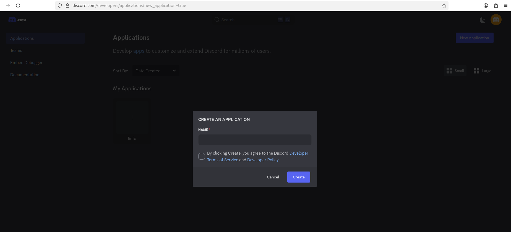
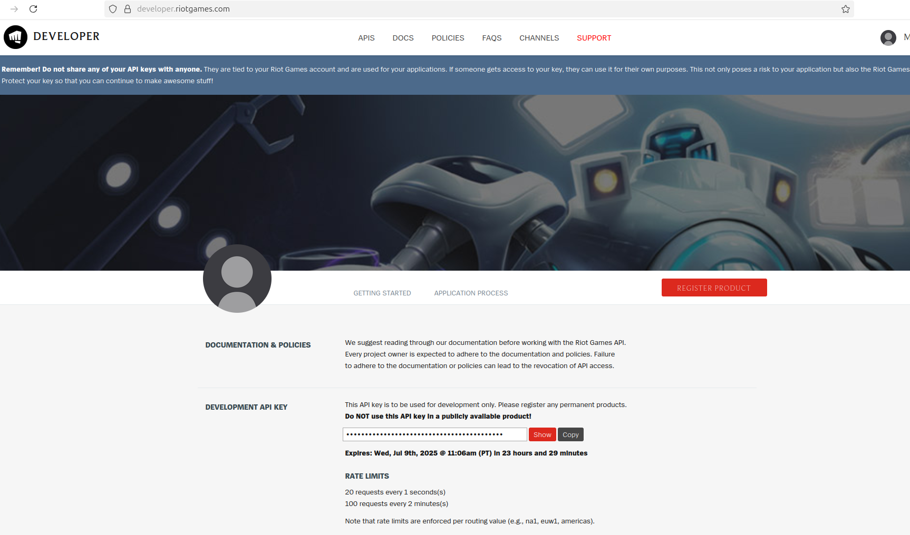

# League-Info Discord Bot

A discord bot to allow League of legends ranked Lp (leaguePoints) to be accessible in text channels by the command

`!lp <GameName>#<tagLine>`

to output a formatted text blob of the summoners current League Point info such as tier, rank, wins, losses and league points


## Set Up

### Requirements
You will need Golang and make for this to run
The version is defined in the go mod files currently `go 1.22.2`


### API Keys
You'd first need to get a discord bot key and grant bot access to the set up Bot


you then will be able to generate a url to grant access to the Bot to a server 

After, You'll need a personal API token from [League of legends Developer API portal](https://developer.riotgames.com/)




then populate the BOT_TOKEN
and LEAGUE_API_TOKEN
in a .env file in the root of the repo


```
BOT_TOKEN=xxxxxx
LEAGUE_API_TOKEN=xxxxx
```


# Start

The `make` command will compile the and run the bot on a designated server 

